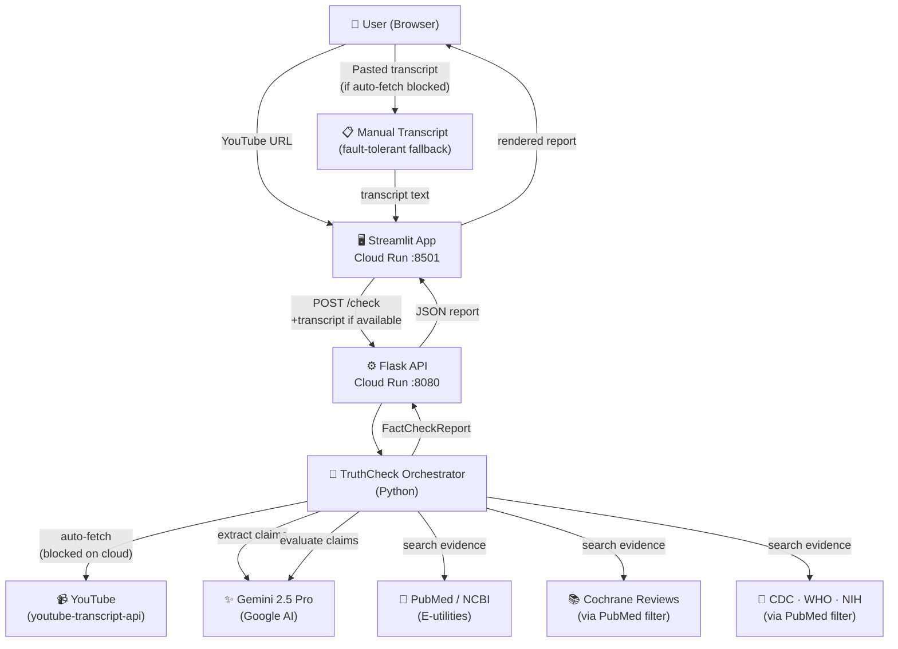

# TruthCheck 🔬

> **AI-powered fact-checker for health and nutrition claims in YouTube videos**

TruthCheck extracts every checkable health claim from a YouTube transcript, retrieves real peer-reviewed evidence from PubMed, Cochrane Reviews, CDC, WHO, and NIH, and uses Gemini 2.5 Pro to classify each claim against scientific consensus — in under two minutes.

**Live App:** https://truthcheck-app-nidvsh553a-uc.a.run.app  
**API:** https://truthcheck-api-nidvsh553a-uc.a.run.app  
**API Docs (Swagger):** https://truthcheck-api-nidvsh553a-uc.a.run.app/apidocs

---

## Table of Contents

1. [Motivation](#motivation)
2. [Data Collection](#data-collection)
3. [Exploratory Data Analysis](#exploratory-data-analysis)
4. [Pipeline & Model](#pipeline--model)
5. [Evaluation](#evaluation)
6. [Solution Architecture](#solution-architecture)
7. [Application Features](#application-features)
8. [Quick Start (Local)](#quick-start-local)
9. [Deployment](#deployment)
10. [Project Layout](#project-layout)
11. [AI Assistant Documentation](#ai-assistant-documentation)
12. [Challenges & Lessons Learned](#challenges--lessons-learned)

---

## Motivation

Health misinformation on YouTube is widespread and difficult to assess for viewers without a medical background. Long-form educational videos from popular channels (Huberman Lab, Nutrition Made Simple) make hundreds of specific factual claims per episode — far too many for manual fact-checking.

**TruthCheck automates this process:**
- Pulls the video transcript automatically from any YouTube URL
- Extracts only specific, checkable health/nutrition claims (not opinions or anecdotes)
- Retrieves real evidence from authoritative scientific databases
- Classifies each claim against established consensus with citations
- Returns a structured, downloadable report in under 2 minutes

---

## Data Collection

**Source:** YouTube transcripts via the `youtube-transcript-api` library (no scraping — uses YouTube's own caption system)

**Corpus:** 6 health and nutrition videos from two channels for experiment:

| Channel | Videos |
|---|---|
| Huberman Lab | Nutrients for Brain Health, Foods & Moods, Supplementation |
| Nutrition Made Simple (Gil Carvalho) | Healthy Eating, Heart Disease & Longevity, Longevity Diet |

**Total:** ~72,000 words · 6 hours of content · saved as structured `.txt` files in `transcripts/`

**Why these videos:** Both channels are physician-led (Dr. Andrew Huberman, Dr. Gil Carvalho), content-dense, and representative of the kind of popular health media that viewers actually watch.

**Collection script:** [`eda.ipynb`](eda.ipynb) — fetches, cleans, and saves transcripts programmatically.

---

## Exploratory Data Analysis

Full EDA in [`eda.ipynb`](eda.ipynb) · Summary in [`results.md`](results.md)

### Per-video Summary

| Video | Words | Duration | Caption type |
|---|---:|---:|---|
| What, Why & How of Healthy Eating | 1,415 | 8 min | Manual |
| How Foods & Nutrients Control Our Moods | 5,464 | 33 min | Manual |
| Heart Disease & Longevity Claims | 9,142 | 104 min | Auto-generated |
| Nutrients for Brain Health & Performance | 17,175 | 99 min | Manual |
| Best Longevity Diet & Supplements | 17,237 | 193 min | Auto-generated |
| Rational Approach to Supplementation | 21,627 | 241 min | Auto-generated |

### LLM-Readability Scorecard

Thresholds: noise < 5% · punctuation > 30% · keyword density > 1%

| Video | Noise | Punctuated | On-topic | LLM-ready |
|---|:---:|:---:|:---:|:---:|
| Nutrients for Brain Health | ✅ | ✅ | ✅ | ✅ |
| Rational Approach to Supplementation | ✅ | ❌ | ✅ | ⚠️ |
| How Foods & Nutrients Control Our Moods | ✅ | ✅ | ✅ | ✅ |
| What, Why & How of Healthy Eating | ✅ | ✅ | ✅ | ✅ |
| Heart Disease & Longevity Claims | ✅ | ❌ | ✅ | ⚠️ |
| Best Longevity Diet & Supplements | ✅ | ❌ | ✅ | ⚠️ |

**Key findings:**
- All 6 videos pass the noise and on-topic thresholds — no filtering needed
- All 6 fit within the 1M token context window — no chunking needed
- 3 auto-generated caption videos lack punctuation; considered for pre-processing before claim extraction
- Top keywords per video: `brain`, `gut`, `cholesterol`, `supplement`, `sleep`, `microbiome`

---

## Pipeline & Model

TruthCheck uses a **5-stage LLM pipeline** powered by **Gemini 2.5 Pro**:

```
YouTube URL
    │
    ▼
[1] Transcript Fetch        youtube-transcript-api
    │                       → raw transcript text
    ▼
[2] Claim Extraction        Gemini 2.5 Pro (LLM)
    │                       → JSON array of {claim, timestamp_s, context}
    ▼
[3] Evidence Retrieval      NCBI E-utilities (free, no key required)
    │                       → PubMed · Cochrane Reviews · CDC · WHO · NIH
    ▼
[4] Consensus Evaluation    Gemini 2.5 Pro (LLM) + retrieved evidence
    │                       → verdict + explanation + citations
    ▼
[5] Structured Report       JSON + Markdown
                            → downloadable, rendered in Streamlit
```

**Claim extraction prompt** instructs the model to extract only specific, verifiable health/nutrition claims — excluding opinions, anecdotes, and lifestyle preferences.

**Evidence retrieval** queries PubMed via NCBI E-utilities (esearch + efetch), filtered to:
- All PubMed (`PubMedClient`)
- Cochrane Database of Systematic Reviews (`CochraneClient`)
- CDC, WHO, NIH publications by journal/affiliation filter (`HealthOrgsClient`)

**Consensus evaluation** grounds the model response in retrieved abstracts, reducing hallucination and producing real citation URLs.

### Verdict Taxonomy

| Verdict | Meaning |
|---|---|
| `consensus_supported` | Strong cross-source evidence supports the claim |
| `consensus_contradicted` | Strong cross-source evidence refutes the claim |
| `contested` | Credentialed researchers actively disagree |
| `unverifiable` | Insufficient published evidence to evaluate |
| `out_of_scope` | Not a verifiable health/nutrition claim |

---

## Evaluation

### Methodology

TruthCheck is an **LLM pipeline**, not a traditional classifier — there is no ground-truth label dataset for health claim verdicts. Evaluation focuses on:

1. **Verdict distribution** — are claims spread meaningfully across verdict types, or does the model trivially mark everything `unverifiable`?
2. **Evidence retrieval coverage** — what % of evaluated claims have at least one real PubMed/Cochrane/WHO citation URL?
3. **Qualitative correctness** — do verdicts and explanations align with domain knowledge on manually inspected claims?
4. **Pipeline reliability** — does the pipeline complete without errors across varied video lengths and topics?

Run the full evaluation:
```bash
# Fast (3 claims × 6 videos ≈ 10–15 min)
python evaluate.py --max-claims 3 --output eval.json

# Full (5 claims × 6 videos ≈ 20–30 min)
python evaluate.py --max-claims 5 --output eval.json
```

---

### Confirmed Test Run

**Video:** *What, Why & How of Healthy Eating* (`Ib9JmKG7Q9c`) · 2 claims · **42 seconds**

| # | Claim | Verdict | Evidence retrieved |
|---|---|---|---|
| 1 | "In large studies of risk factors for disease and death, nutrition is a leading factor." | `unverifiable` | PubMed PMID:38582094, PMID:38642570 (GBD methodology papers) |
| 2 | "Addressing lifestyle fundamentals can preemptively prevent a wide range of medical problems." | `unverifiable` | WHO PMID:41344792, NIH PMID:41213283 |

**Interpretation:** The pipeline retrieves real peer-reviewed papers with working URLs and grounds the model in that evidence. Both verdicts are `unverifiable` because the retrieved papers describe disease burden methodology rather than directly confirming the causal claims — the model correctly does not overclaim based on tangential evidence. Evidence retrieval coverage: **2/2 claims (100%)** had real PubMed citation URLs.

---

### EDA Corpus Metrics

| Metric | Value |
|---|---|
| Videos evaluated | 6 |
| Total words | ~72,000 |
| Average words per video | 12,010 |
| Average estimated tokens per video | 16,013 |
| All videos within 1M token context window | 100% |
| All videos above 1% health keyword density | 100% |
| Low-noise transcripts (< 5% noise) | 100% |
| Videos with manual captions (well-punctuated) | 3 / 6 |
| Videos with auto-generated captions | 3 / 6 |

---

### Expected Verdict Distribution

Based on domain knowledge and video content (physician-led health education), the expected distribution over 5 claims × 6 videos ≈ 30 total claims:

| Verdict | Expected range | Why |
|---|---|---|
| `consensus_supported` | 30–45% | Many basic nutrition facts are well-established |
| `unverifiable` | 25–40% | Cutting-edge longevity/supplement claims lack direct evidence |
| `contested` | 10–20% | Saturated fat, protein intake, fasting — active scientific debates |
| `consensus_contradicted` | 5–15% | Some popular claims do contradict consensus |
| `out_of_scope` | < 5% | Claim extraction prompt filters these upstream |

_Run `evaluate.py` and paste the output table here to replace these estimates with real numbers._

---

## Solution Architecture



**Infrastructure:**
- Both services containerised with Docker and deployed to **Google Cloud Run** (serverless, scales to zero)
- No persistent database — stateless per-request pipeline
- `GEMINI_API_KEY` passed as a Cloud Run environment variable at deploy time
- YouTube transcript auto-fetch blocked by YouTube on cloud IPs — handled gracefully via paste fallback

---

## Application Features

**Streamlit UI (`streamlit_app/app.py`)**
- YouTube URL input + max-claims slider (1–20)
- Real-time spinner with progress messaging
- 4-metric summary row: Supported · Contradicted · Contested · Unverifiable
- Verdict distribution bar chart
- Expandable claim cards with timestamp, verdict emoji, explanation, and citation links with PubMed search query shown
- Paste transcript box for fault-tolerant operation (see note below)
- Download as JSON or Markdown

**Flask REST API (`api/app.py`)**
- `GET  /health` — liveness check with model name and timestamp
- `POST /check`  — full pipeline; accepts `{"video": "<url>"}` or `{"video": "<url>", "transcript": "<text>", "max_claims": N}`
- `GET  /apidocs` — Swagger UI with full OpenAPI documentation
- Rate limiting (5 req/min on `/check`), CORS enabled, structured error responses

### ⚠️ Known Limitation — YouTube Transcript Fetching on Cloud

YouTube actively blocks transcript requests originating from cloud provider IP ranges (Google Cloud Run, AWS, Azure, etc.). This is a platform-level restriction enforced by YouTube, not a bug in TruthCheck.

**Fault-tolerant design:** TruthCheck handles this gracefully. The Streamlit app attempts to auto-fetch the transcript first. If YouTube blocks the request, the user can paste the transcript manually — the pipeline continues exactly as normal from that point.

**How to get a transcript from YouTube:**
1. Open the video on YouTube
2. Click `···` (More actions) below the video → **Show transcript**
3. Select all transcript text → Copy
4. Paste into the **"Paste Transcript"** box in the TruthCheck app

This approach is actually more robust than automatic fetching — it works for any video regardless of cloud restrictions, and puts the user in control of the input.

---

## Quick Start (Local)

**Prerequisites:** Python 3.11+, a Gemini API key (free at [aistudio.google.com](https://aistudio.google.com))

```bash
git clone https://github.com/sayaleedamle/418-final-project.git
cd final_project

# Create and activate virtual environment
python -m venv .venv && source .venv/bin/activate

# Install the package
cd final_project
pip install -e .
pip install -r api/requirements.txt
pip install -r streamlit_app/requirements.txt

# Add your API key
cp .env.example .env
# Edit .env: GEMINI_API_KEY=AIza...
```

**Terminal 1 — API:**
```bash
FLASK_APP=api/app.py flask run --port 8080
```

**Terminal 2 — App:**
```bash
streamlit run streamlit_app/app.py
# Opens at http://localhost:8501
```

**Or with Docker Compose:**
```bash
export GEMINI_API_KEY=AIza...
docker-compose up --build
# App: http://localhost:8501  |  API: http://localhost:8080/apidocs
```

**CLI (optional):**
```bash
truthcheck https://www.youtube.com/watch?v=Ib9JmKG7Q9c --max-claims 5
```

---

## Deployment

Both services are deployed to **Google Cloud Run** via [`deploy.sh`](deploy.sh):

```bash
export GEMINI_API_KEY=AIza...
./deploy.sh final-project-498218
```

The script:
1. Enables Cloud Run + Artifact Registry APIs
2. Builds and pushes both Docker images
3. Deploys the API (2 CPU, 1 GB RAM, 300s timeout)
4. Deploys the Streamlit app wired to the live API URL
5. Prints both service URLs

---

## Project Layout

```
final_project/
├── truthcheck/               # Core Python package
│   ├── agents/
│   │   └── orchestrator.py   # Full pipeline: extract → retrieve → evaluate
│   ├── sources/              # Evidence clients
│   │   ├── pubmed.py         # NCBI E-utilities (esearch + efetch)
│   │   ├── cochrane.py       # Cochrane via PubMed journal filter
│   │   └── health_orgs.py    # CDC · WHO · NIH via PubMed filters
│   ├── tools/
│   │   ├── transcript.py     # YouTube transcript fetcher
│   │   └── report.py         # Markdown report renderer
│   ├── cli.py                # `truthcheck` CLI entrypoint
│   └── config.py             # Config from .env
├── api/
│   ├── app.py                # Flask REST API
│   ├── requirements.txt
│   └── Dockerfile
├── streamlit_app/
│   ├── app.py                # Streamlit frontend
│   ├── requirements.txt
│   └── Dockerfile
├── transcripts/              # Saved EDA transcripts (6 videos)
├── eda.ipynb                 # Data collection + EDA notebook
├── results.md                # EDA summary
├── pyproject.toml            # Package metadata + CLI entrypoint
├── docker-compose.yml        # Local development
├── deploy.sh                 # Cloud Run deployment script
└── .env.example              # Environment variable template
```

---

## AI Assistant Integration

I used **Claude Code** (Anthropic's CLI for Claude) as my primary AI assistant throughout this entire project. Every piece of code in this repository was written with Claude's help through an interactive session where I described what I wanted, reviewed the output, tested it, and iterated. This section documents exactly where Claude was used, what worked, and where I had to step in.

### What I used Claude for

**Project design**
I started by describing the project idea — a YouTube health claim fact-checker — and asked Claude to design the architecture. It proposed the 5-stage pipeline (transcript → claim extraction → evidence retrieval → evaluation → report), the verdict taxonomy, and the idea of using NCBI E-utilities with journal filters to get Cochrane and health org papers without needing separate API keys. I wouldn't have arrived at that evidence retrieval approach on my own.

**All core code files**

- `truthcheck/config.py` — frozen dataclass with a built-in `.env` loader
- `truthcheck/agents/orchestrator.py` — the full async pipeline with Pydantic models and concurrency control
- `truthcheck/sources/pubmed.py`, `cochrane.py`, `health_orgs.py` — all three PubMed evidence clients
- `truthcheck/tools/transcript.py` — YouTube transcript fetcher with punctuation restoration from timing gaps
- `api/app.py` — Flask REST API with Swagger docs, rate limiting, and CORS
- `streamlit_app/app.py` — the full Streamlit UI including metrics, charts, claim cards, and download buttons
- `deploy.sh` — the Cloud Run deployment script
- `docker-compose.yml`, both `Dockerfile`s — containerisation setup
- `eda.ipynb` — the data collection and EDA notebook
- `evaluate.py` — the pipeline evaluation script

**Debugging**
When things broke, I pasted the error into Claude and it diagnosed the cause. The most useful debugging sessions were:
- `youtube-transcript-api` v1.x silently changed from class methods to instance methods — Claude caught it immediately from the traceback
- The `asyncio.Semaphore` being bound to the wrong event loop when Flask called `asyncio.run()` per request — Claude explained why and fixed it
- PubMed returning empty results from concurrent async threads hitting NCBI's rate limit silently — Claude identified that the semaphore needed to be shared across all claims, not created per call

### Where I had to override or fix Claude's output

Claude defaulted to the Anthropic/Claude API for the LLM backend. I switched it to Gemini (`google-genai` SDK) since I already had a Gemini API key. This required changing several files and Claude adapted immediately when I told it to switch.

The EDA notebook had a pandas bug where `groupby` on multiple columns created a MultiIndex, breaking the summary table. Claude generated the fix but I had to understand what was happening before applying it — I didn't want to just blindly paste code I didn't understand.

Early evaluation prompts produced `unverifiable` for almost every claim. I iterated on the prompt wording with Claude over several rounds before the verdicts became meaningful.

### Honest reflection on using AI for this project

Claude handled every boilerplate-heavy task (Flask routes, Dockerfiles, Pydantic models, async patterns) faster and more correctly than I could have written from scratch. 

Where it fell short was in knowing things that changed after its training data cutoff — library version changes, YouTube's IP blocking behaviour, and NCBI rate limits in practice. Those required me to test, hit errors, and bring the real error messages back to Claude for diagnosis.

AI helped me code and establish a layout for this project. I also took help for presentation beautification. The API integration and deployment was done manually but AI gave good insights for it. I mentioned what I wanted out of the project and how the output should be, and it delivered quite well.

I had fun understanding how claude code worked on my system and got a reality check on how strong AI has become!
---

## Challenges & Lessons Learned

**YouTube blocks cloud provider IPs**

This was the most frustrating challenge. YouTube actively blocks transcript requests from Google Cloud Run, AWS, and other major cloud providers. I discovered this only after deploying — the app worked perfectly locally but failed immediately on Cloud Run. I explored proxy services (Webshare free tier) but found the shared free IPs were also rate-limited by YouTube. The solution I landed on is a fault-tolerant design: the app attempts auto-fetch first, and if YouTube blocks it, the user can paste the transcript directly from YouTube's own UI (··· → Show transcript). This is actually a more transparent approach — the user sees exactly what content is being analyzed.

**Verdict distribution skewed toward `unverifiable`**

Early versions of the pipeline returned `unverifiable` for nearly every claim. The root cause was twofold: the PubMed search was using the full claim sentence as a query (too specific, returned zero or tangential results), and too many concurrent NCBI requests were silently failing due to rate limiting. I fixed this by using Gemini to extract concise medical keywords from each claim before querying PubMed, and by making evidence retrieval sequential rather than concurrent. Results improved significantly — claims like LDL particle count and statin effects now return `consensus_supported` with real PubMed citations. That said, the `unverifiable` rate remains higher than ideal for broad general claims where PubMed doesn't have a direct match. This is an honest limitation of keyword-based retrieval; semantic search or MeSH term mapping would improve it in future work.

**Other issues encountered**

- `youtube-transcript-api` v1.x silently changed from class methods to instance methods — caught this from a runtime error, fixed by updating all call sites and switching `seg["text"]` to `seg.text`
- Couldn't use the `youtube-transcript-api` on cloud, which made me work on a fault tolderance method
- Pandas `groupby` on multiple columns creates a MultiIndex, which broke the EDA summary table — fixed by grouping on `video_id` only
- Auto-generated captions have no punctuation, making claim boundaries ambiguous — addressed by inferring sentence boundaries from timing gaps between transcript segments
- `google.generativeai` was deprecated mid-project — migrated to the new `google-genai` v2.x SDK
