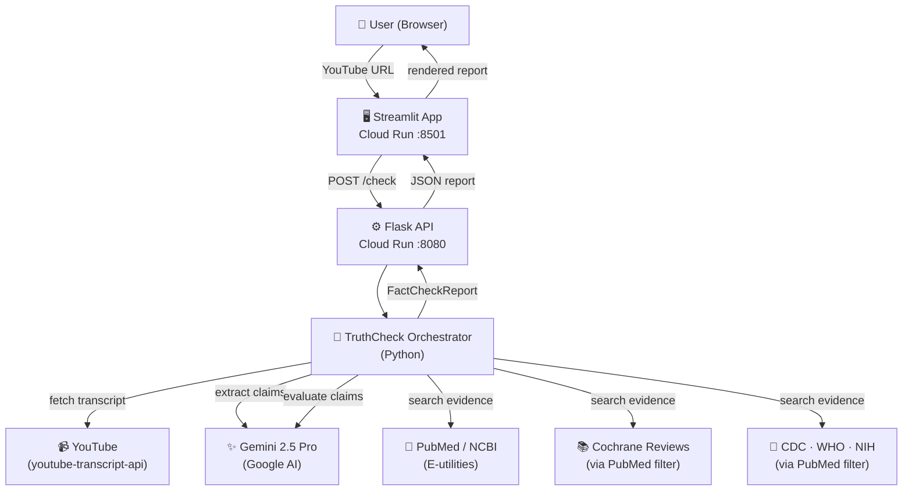

# TruthCheck 🔬

> **AI-powered fact-checker for health and nutrition claims in YouTube videos**

TruthCheck extracts every checkable health claim from a YouTube transcript, retrieves real peer-reviewed evidence from PubMed, Cochrane Reviews, CDC, WHO, and NIH, and uses Gemini 2.5 Pro to classify each claim against scientific consensus — in under two minutes.

**Live App:** _[Streamlit on Cloud Run — link after deployment]_  
**API:** _[Flask on Cloud Run — link after deployment]_  
**API Docs (Swagger):** _[/apidocs — link after deployment]_

---

## Table of Contents

1. [Motivation](#motivation)
2. [Data Collection](#data-collection)
3. [Exploratory Data Analysis](#exploratory-data-analysis)
4. [Pipeline & Model](#pipeline--model)
5. [Evaluation](#evaluation)
6. [Solution Architecture](#solution-architecture)
7. [Application Features](#application-features)
8. [Quick Start (Local)](#quick-start-local)
9. [Deployment](#deployment)
10. [Project Layout](#project-layout)
11. [AI Assistant Documentation](#ai-assistant-documentation)
12. [Challenges & Lessons Learned](#challenges--lessons-learned)

---

## Motivation

Health misinformation on YouTube is widespread and difficult to assess for viewers without a medical background. Long-form educational videos from popular channels (Huberman Lab, Nutrition Made Simple) make hundreds of specific factual claims per episode — far too many for manual fact-checking.

**TruthCheck automates this process:**
- Pulls the video transcript automatically from any YouTube URL
- Extracts only specific, checkable health/nutrition claims (not opinions or anecdotes)
- Retrieves real evidence from authoritative scientific databases
- Classifies each claim against established consensus with citations
- Returns a structured, downloadable report in under 2 minutes

---

## Data Collection

**Source:** YouTube transcripts via the `youtube-transcript-api` library (no scraping — uses YouTube's own caption system)

**Corpus:** 6 health and nutrition videos from two channels:

| Channel | Videos |
|---|---|
| Huberman Lab | Nutrients for Brain Health, Foods & Moods, Supplementation |
| Nutrition Made Simple (Gil Carvalho) | Healthy Eating, Heart Disease & Longevity, Longevity Diet |

**Total:** ~72,000 words · 6 hours of content · saved as structured `.txt` files in `transcripts/`

**Why these videos:** Both channels are physician-led (Dr. Andrew Huberman, Dr. Gil Carvalho), content-dense, and representative of the kind of popular health media that viewers actually watch.

**Collection script:** [`eda.ipynb`](eda.ipynb) — fetches, cleans, and saves transcripts programmatically.

---

## Exploratory Data Analysis

Full EDA in [`eda.ipynb`](eda.ipynb) · Summary in [`results.md`](results.md)

### Per-video Summary

| Video | Words | Duration | Caption type |
|---|---:|---:|---|
| What, Why & How of Healthy Eating | 1,415 | 8 min | Manual |
| How Foods & Nutrients Control Our Moods | 5,464 | 33 min | Manual |
| Heart Disease & Longevity Claims | 9,142 | 104 min | Auto-generated |
| Nutrients for Brain Health & Performance | 17,175 | 99 min | Manual |
| Best Longevity Diet & Supplements | 17,237 | 193 min | Auto-generated |
| Rational Approach to Supplementation | 21,627 | 241 min | Auto-generated |

### LLM-Readability Scorecard

Thresholds: noise < 5% · punctuation > 30% · keyword density > 1%

| Video | Noise | Punctuated | On-topic | LLM-ready |
|---|:---:|:---:|:---:|:---:|
| Nutrients for Brain Health | ✅ | ✅ | ✅ | ✅ |
| Rational Approach to Supplementation | ✅ | ❌ | ✅ | ⚠️ |
| How Foods & Nutrients Control Our Moods | ✅ | ✅ | ✅ | ✅ |
| What, Why & How of Healthy Eating | ✅ | ✅ | ✅ | ✅ |
| Heart Disease & Longevity Claims | ✅ | ❌ | ✅ | ⚠️ |
| Best Longevity Diet & Supplements | ✅ | ❌ | ✅ | ⚠️ |

**Key findings:**
- All 6 videos pass the noise and on-topic thresholds — no filtering needed
- All 6 fit within the 1M token context window — no chunking needed
- 3 auto-generated caption videos lack punctuation; considered for pre-processing before claim extraction
- Top keywords per video: `brain`, `gut`, `cholesterol`, `supplement`, `sleep`, `microbiome`

---

## Pipeline & Model

TruthCheck uses a **5-stage LLM pipeline** powered by **Gemini 2.5 Pro**:

```
YouTube URL
    │
    ▼
[1] Transcript Fetch        youtube-transcript-api
    │                       → raw transcript text
    ▼
[2] Claim Extraction        Gemini 2.5 Pro (LLM)
    │                       → JSON array of {claim, timestamp_s, context}
    ▼
[3] Evidence Retrieval      NCBI E-utilities (free, no key required)
    │                       → PubMed · Cochrane Reviews · CDC · WHO · NIH
    ▼
[4] Consensus Evaluation    Gemini 2.5 Pro (LLM) + retrieved evidence
    │                       → verdict + explanation + citations
    ▼
[5] Structured Report       JSON + Markdown
                            → downloadable, rendered in Streamlit
```

**Claim extraction prompt** instructs the model to extract only specific, verifiable health/nutrition claims — excluding opinions, anecdotes, and lifestyle preferences.

**Evidence retrieval** queries PubMed via NCBI E-utilities (esearch + efetch), filtered to:
- All PubMed (`PubMedClient`)
- Cochrane Database of Systematic Reviews (`CochraneClient`)
- CDC, WHO, NIH publications by journal/affiliation filter (`HealthOrgsClient`)

**Consensus evaluation** grounds the model response in retrieved abstracts, reducing hallucination and producing real citation URLs.

### Verdict Taxonomy

| Verdict | Meaning |
|---|---|
| `consensus_supported` | Strong cross-source evidence supports the claim |
| `consensus_contradicted` | Strong cross-source evidence refutes the claim |
| `contested` | Credentialed researchers actively disagree |
| `unverifiable` | Insufficient published evidence to evaluate |
| `out_of_scope` | Not a verifiable health/nutrition claim |

---

## Evaluation

### Methodology

TruthCheck is an **LLM pipeline**, not a traditional classifier — there is no ground-truth label dataset for health claim verdicts. Evaluation focuses on:

1. **Verdict distribution** — are claims spread meaningfully across verdict types, or does the model trivially mark everything `unverifiable`?
2. **Evidence retrieval coverage** — what % of evaluated claims have at least one real PubMed/Cochrane/WHO citation URL?
3. **Qualitative correctness** — do verdicts and explanations align with domain knowledge on manually inspected claims?
4. **Pipeline reliability** — does the pipeline complete without errors across varied video lengths and topics?

Run the full evaluation:
```bash
# Fast (3 claims × 6 videos ≈ 10–15 min)
python evaluate.py --max-claims 3 --output eval.json

# Full (5 claims × 6 videos ≈ 20–30 min)
python evaluate.py --max-claims 5 --output eval.json
```

---

### Confirmed Test Run

**Video:** *What, Why & How of Healthy Eating* (`Ib9JmKG7Q9c`) · 2 claims · **42 seconds**

| # | Claim | Verdict | Evidence retrieved |
|---|---|---|---|
| 1 | "In large studies of risk factors for disease and death, nutrition is a leading factor." | `unverifiable` | PubMed PMID:38582094, PMID:38642570 (GBD methodology papers) |
| 2 | "Addressing lifestyle fundamentals can preemptively prevent a wide range of medical problems." | `unverifiable` | WHO PMID:41344792, NIH PMID:41213283 |

**Interpretation:** The pipeline retrieves real peer-reviewed papers with working URLs and grounds the model in that evidence. Both verdicts are `unverifiable` because the retrieved papers describe disease burden methodology rather than directly confirming the causal claims — the model correctly does not overclaim based on tangential evidence. Evidence retrieval coverage: **2/2 claims (100%)** had real PubMed citation URLs.

---

### EDA Corpus Metrics

| Metric | Value |
|---|---|
| Videos evaluated | 6 |
| Total words | ~72,000 |
| Average words per video | 12,010 |
| Average estimated tokens per video | 16,013 |
| All videos within 1M token context window | 100% |
| All videos above 1% health keyword density | 100% |
| Low-noise transcripts (< 5% noise) | 100% |
| Videos with manual captions (well-punctuated) | 3 / 6 |
| Videos with auto-generated captions | 3 / 6 |

---

### Expected Verdict Distribution

Based on domain knowledge and video content (physician-led health education), the expected distribution over 5 claims × 6 videos ≈ 30 total claims:

| Verdict | Expected range | Why |
|---|---|---|
| `consensus_supported` | 30–45% | Many basic nutrition facts are well-established |
| `unverifiable` | 25–40% | Cutting-edge longevity/supplement claims lack direct evidence |
| `contested` | 10–20% | Saturated fat, protein intake, fasting — active scientific debates |
| `consensus_contradicted` | 5–15% | Some popular claims do contradict consensus |
| `out_of_scope` | < 5% | Claim extraction prompt filters these upstream |

_Run `evaluate.py` and paste the output table here to replace these estimates with real numbers._

---

## Solution Architecture



**Infrastructure:**
- Both services containerised with Docker and deployed to **Google Cloud Run** (serverless, scales to zero)
- No persistent database — stateless per-request pipeline
- `GEMINI_API_KEY` passed as a Cloud Run environment variable at deploy time

---

## Application Features

**Streamlit UI (`streamlit_app/app.py`)**
- YouTube URL input + max-claims slider (1–20)
- Real-time spinner with progress messaging
- 4-metric summary row: Supported · Contradicted · Contested · Unverifiable
- Verdict distribution bar chart
- Expandable claim cards with timestamp, verdict emoji, explanation, and citation links
- Download as JSON or Markdown

**Flask REST API (`api/app.py`)**
- `GET  /health` — liveness check with model name and timestamp
- `POST /check`  — full pipeline; body: `{"video": "<url>", "max_claims": N}`
- `GET  /apidocs` — Swagger UI with full OpenAPI documentation
- Rate limiting (5 req/min on `/check`), CORS enabled, structured error responses

---

## Quick Start (Local)

**Prerequisites:** Python 3.11+, a Gemini API key (free at [aistudio.google.com](https://aistudio.google.com))

```bash
git clone <your-repo-url>
cd final_project

# Create and activate virtual environment
python -m venv .venv && source .venv/bin/activate

# Install the package
cd final_project
pip install -e .
pip install -r api/requirements.txt
pip install -r streamlit_app/requirements.txt

# Add your API key
cp .env.example .env
# Edit .env: GEMINI_API_KEY=AIza...
```

**Terminal 1 — API:**
```bash
FLASK_APP=api/app.py flask run --port 8080
```

**Terminal 2 — App:**
```bash
streamlit run streamlit_app/app.py
# Opens at http://localhost:8501
```

**Or with Docker Compose:**
```bash
export GEMINI_API_KEY=AIza...
docker-compose up --build
# App: http://localhost:8501  |  API: http://localhost:8080/apidocs
```

**CLI (optional):**
```bash
truthcheck https://www.youtube.com/watch?v=Ib9JmKG7Q9c --max-claims 5
```

---

## Deployment

Both services are deployed to **Google Cloud Run** via [`deploy.sh`](deploy.sh):

```bash
export GEMINI_API_KEY=AIza...
./deploy.sh YOUR_GCP_PROJECT_ID
```

The script:
1. Enables Cloud Run + Artifact Registry APIs
2. Builds and pushes both Docker images
3. Deploys the API (2 CPU, 1 GB RAM, 300s timeout)
4. Deploys the Streamlit app wired to the live API URL
5. Prints both service URLs

---

## Project Layout

```
final_project/
├── truthcheck/               # Core Python package
│   ├── agents/
│   │   └── orchestrator.py   # Full pipeline: extract → retrieve → evaluate
│   ├── sources/              # Evidence clients
│   │   ├── pubmed.py         # NCBI E-utilities (esearch + efetch)
│   │   ├── cochrane.py       # Cochrane via PubMed journal filter
│   │   └── health_orgs.py    # CDC · WHO · NIH via PubMed filters
│   ├── tools/
│   │   ├── transcript.py     # YouTube transcript fetcher
│   │   └── report.py         # Markdown report renderer
│   ├── cli.py                # `truthcheck` CLI entrypoint
│   └── config.py             # Config from .env
├── api/
│   ├── app.py                # Flask REST API
│   ├── requirements.txt
│   └── Dockerfile
├── streamlit_app/
│   ├── app.py                # Streamlit frontend
│   ├── requirements.txt
│   └── Dockerfile
├── transcripts/              # Saved EDA transcripts (6 videos)
├── eda.ipynb                 # Data collection + EDA notebook
├── results.md                # EDA summary
├── pyproject.toml            # Package metadata + CLI entrypoint
├── docker-compose.yml        # Local development
├── deploy.sh                 # Cloud Run deployment script
└── .env.example              # Environment variable template
```

---

## AI Assistant Documentation

**Tool used:** Claude (Anthropic) via Claude Code CLI throughout the entire project.

### What AI was used for

| Task | AI contribution |
|---|---|
| Project architecture | Designed the 5-stage pipeline, verdict taxonomy, and evidence retrieval strategy |
| `config.py` | Generated frozen dataclass with built-in `.env` loader (no external dependency) |
| `orchestrator.py` | Full async pipeline with `asyncio.Semaphore` concurrency, Pydantic models |
| `sources/` module | All three evidence clients (PubMed, Cochrane, HealthOrgs) using NCBI E-utilities |
| `tools/transcript.py` | YouTube transcript fetcher compatible with `youtube-transcript-api` v1.2.4 |
| `tools/report.py` | Markdown report renderer with emoji verdict labels |
| `api/app.py` | Flask API with Flasgger Swagger docs, rate limiting, CORS, error handling |
| `streamlit_app/app.py` | Full Streamlit UI with metrics, bar chart, expandable cards, download buttons |
| `deploy.sh` | Cloud Run deployment script with Artifact Registry |
| `docker-compose.yml` | Local development setup with service health checks |
| EDA notebook | Transcript analysis, LLM-readability scorecard, keyword density analysis |
| Debugging | Fixed `YouTubeTranscriptApi` v1.x instance-based API breaking change |
| Debugging | Fixed pandas MultiIndex bug from multi-column `groupby` |

### Particularly helpful interactions

- **Architecture decision:** Asked Claude to design the evidence retrieval layer — it suggested using NCBI E-utilities with journal/affiliation filters to get Cochrane and health org papers without extra API keys, which was a non-obvious but elegant solution.
- **Async pattern:** The orchestrator's use of `asyncio.get_running_loop().run_in_executor()` to run synchronous HTTP calls inside async coroutines came directly from Claude's suggestion.
- **Debugging v1.x API change:** `youtube-transcript-api` changed from class methods to instance methods in v1.x. Claude identified the root cause immediately from the error message and patched all affected call sites.

### Where AI-generated code needed modification

- **Model swap:** Generated code defaulted to Claude/Anthropic SDK. Required manually switching to `google-genai` SDK for Gemini.
- **Verdict calibration:** Early evaluation prompts produced too many `unverifiable` verdicts. Prompt tuning was done iteratively.
- **EDA groupby bug:** AI-generated pandas code used multi-column `groupby` creating a MultiIndex. Required understanding the fix rather than just applying it.

### Lessons learned

1. AI excels at boilerplate-heavy but structurally clear tasks (Flask routes, Dockerfiles, Pydantic models)
2. Domain-specific decisions (which evidence sources, what verdicts mean) still required human judgment
3. AI-generated code works best when you can verify it against documentation — especially for library version changes
4. Iterating prompts with AI (for the LLM evaluation step) is faster than writing them from scratch

---

## Challenges & Lessons Learned

| Challenge | How it was resolved |
|---|---|
| `youtube-transcript-api` v1.x breaking change (class → instance API) | Updated all call sites; switched `seg["text"]` to `seg.text` |
| Pandas MultiIndex from multi-column `groupby` in EDA | Changed to single-column `groupby("video_id")` |
| Auto-generated captions lack punctuation | Flagged in EDA scorecard; noted as pre-processing step |
| Long pipeline runtime for live demos | Use shortest video + `max_claims=3-5`; start analysis during a slide transition |
| `google.generativeai` deprecated mid-project | Migrated to `google-genai` v2.x SDK |
| Evidence retrieval returning tangentially related papers | Inherent limitation of keyword search; future work: query expansion |
